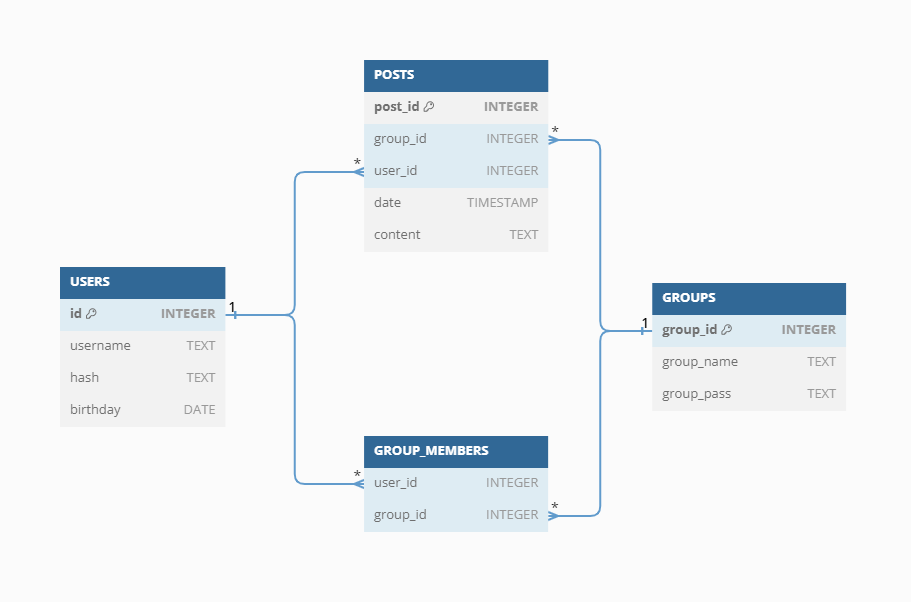

# Kesis: A Social Media Platform for Private Communities

## Overview

Kesis is a robust social media platform designed specifically for private communities. It provides users with the ability to create and join private groups, share posts, and engage with other members who share similar interests.

## Video Demo

For a quick overview of Kesis, check out this [short video demo](https://www.youtube.com/watch?v=1YXpfPYnxjE).

## What is Kesis?

Kesis serves as a hub where users can connect with like-minded individuals and build communities around shared interests.

## Features

Kesis offers the following key features:

- **Create Private Communities:** Users can establish their own private communities tailored to their interests.

- **Post Sharing and Communication:** Members can share posts and engage in discussions within their chosen groups.

- **Explore and Discover:** Users have the opportunity to explore and discover new communities and topics that align with their preferences.

## Technologies and Tools

Kesis is built using the following technologies and tools:

- **Python-Flask:** The web application framework that forms the backbone of Kesis.

- **Jinja2:** A template engine for Python, utilized for rendering dynamic content.

- **SQLite3:** The relational database management system employed to store user data securely.

- **HTML, CSS, Bootstrap:** Front-end technologies ensuring an intuitive and visually appealing user interface.

## Functionality of Kesis

### SQLite3 Database Diagram

Below is a snapshot of the SQLite3 database schema used in Kesis:

### Function Explanations

#### / (Homepage)

Displays the homepage, providing users with essential information and navigation options.

#### /register, /login, /logout

Handles user registration, login, and logout processes. User passwords are securely stored using hashing techniques, and authorization information is stored in the SQLite3 database.

#### /feed

- Users can share posts within the groups they are part of.
- The feed displays all posts from the groups a user has joined.

The implementation utilizes SQLite3 and Jinja2 templates. The SQL library function of cs50 is employed for database interactions.

#### /groups

- Create Groups
- Join Groups

Two different forms are used, presenting users with options to view existing groups and create new ones on the same page. The backend processes form submissions to create new groups. Users can join other groups by clicking the "join" button, redirecting them to groups/<group_name>/lock.

#### /profile

- Display Profile Information
- View options for all groups joined by the user

Jinja2 and SQLite3 are employed to retrieve and display user information. Users are redirected to /groups/{{group['group_name']}} using Jinja2.

#### /groups/<group_name>

- View all group posts
- Share posts within the group

The system validates if the logged-in user is a member of the group before allowing access. Unauthorized users are redirected to groups/<group_name>.

#### /groups/<group_name>/lock

- Join groups by entering the password
- Protection system prevents unauthorized access to group content

When users attempt to join a group, they are redirected to this page to enter the group password. Unauthorized users attempting to access groups they haven't joined are automatically redirected here.
